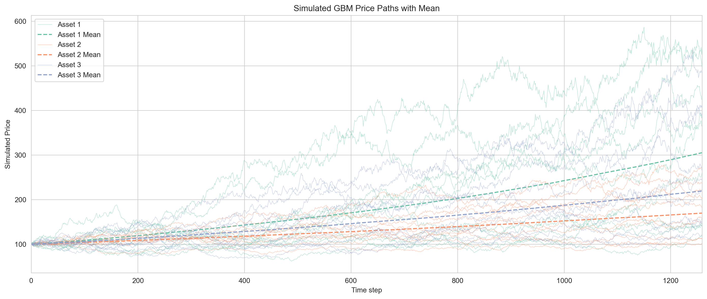
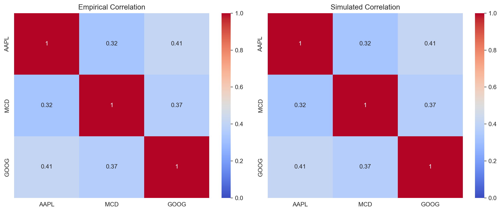

# ESG: Economic Scenario Generator

Welcome! This project is my own lightweight attempt at an **Economic Scenario Generator (ESG)** based on correlated geometric Brownian motion.



---

## Project Scope

### Current
* Simulates realistic multi-asset price paths using **correlated log returns**
* Calibrates to historical data using estimated drift, volatility, and correlation
* Validates that simulations reproduce the empirical statistics accurately
* Fully vectorized and tested on millions of paths for accuracy

### Future
* Add features that allow for time-varying volatility, such as GARCH-based models.
* Add other asset classes to the selection.

---

## How It Works

### Core functions (in `src/`):

* `simulate_correlated_logreturns()` — simulates correlated log returns using Cholesky decomposition
* `build_prices()` — builds asset price paths from simulated log returns
* `get_ticker_data()` *(work in progress)* — fetches Yahoo Finance data and computes inputs

### Validation (in `test/`):

* Uses 'AAPL', 'MCD', 'GOOG' for historical returns
* Computes theoretical vs simulated drift, volatility, and correlation
* Reports % error in basis points (bps)
* Confirms the ESG engine is working as expected

---

## Project Structure

```
ESG/
--- src/                               # Simulation engine
------ simulate.py                    # Main logic
--- test/
------_run_correlated_simulation.py  # Validation against real data
--- data/
------ prices-split-adjusted.csv      # Input data (from Kaggle)
--- README.md                          # You're here
```

---

## Running the Simulation Test

```bash
python test/_run_correlated_simulation.py
```

This script will:

* Load historical data
* Compute inputs (drift, vol, corr)
* Simulate log returns for multiple assets
* Compare simulated stats to actual historical ones

You’ll see a comparison printed to the console, with percentage differences in basis points.

---

## Sample Output

```
Empirical mean of historical log-returns (E_X):
 [0.00075635 0.00037597 0.00051396]
Simulated mean of log-returns:
 [0.00074555 0.0003705  0.00050859]
% difference (mean):
 [-1.4273803  -1.45528881 -1.04579082]

Empirical std dev of historical log-returns (SD_X):
 [0.01653339 0.00959149 0.01561183]
Simulated std dev of log-returns:
 [0.01653017 0.00959267 0.01561213]
% difference (std dev):
 [-0.01947327  0.01236005  0.00193448]

Empirical correlation matrix:
 [[1.         0.32133439 0.41353331]
 [0.32133439 1.         0.36582982]
 [0.41353331 0.36582982 1.        ]]
Simulated correlation matrix:
 [[1.         0.32109635 0.41362734]
 [0.32109635 1.         0.36600567]
 [0.41362734 0.36600567 1.        ]]

These results show that the simulation accurately replicates the underlying statistical structure of the historical data.
```



---

## To-Do

Here are some ideas for what’s next:

* [ ] Rewrite in OOP format
* [ ] Add support for dividends (currently only modelling price return)
* [ ] Add stochastic volatility
* [ ] Incorporate jumps (Merton or Kou)
* [ ] Extend/fix `get_ticker_data()` 
* [ ] Wrap simulations into a small web app for live demo or API

---

## Author

Developed by **Ryan Olivier**.
---